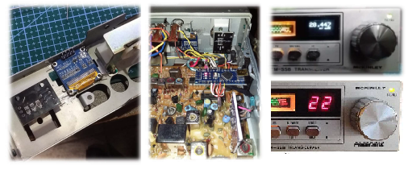

# McKINLEY_DDS
***Reforma CB´s President McKINLEY con DDS SI5351***

Hernan Porrini LW1EHP

# ¿Para que la reforma?
En este articulo describiremos como reformar el President McKinley, esta descripción con un poco de ingenio y astucia podrá ser utilizada en cualquier otro banda ciudadana de similares características, esta reforma nos permite obtener un equipo banda corrida y además la extensión a la banda 10 metros de 28,000 a 29,700, en algunos equipos con un ajuste adecuado permite acceder a la banda de 12 metros de 24,890 a 24,990.

# ¿Que necesitamos?
Lo mismo de siempre en la reformas con DDS, un microcontrolador (Arduino NANO), un Display LCD/OLED y un Módulo DDS que puede ser el SI5351 o el AD9850 y un puñado de componentes electrónicos

# Concepto de la reforma
En esta imagen, se resumen todo el diagrama de bloques del PLL del McKinley, el esquema es genérico para varios chasis producidos por la UNIDEN.
Puede parecer algo complicado para algunos, pero lo importante es entender un concepto simple. En el caso de la recepción la señal entrante debe mezclarse con una señal generada por el VCO, su diferencia deberá ser siempre 10.695 MHz. Por lo tanto si se quisiera operar una señal en 30 Mhz ¿Que señal debería proveer el VCO? La respuesta es sencilla la diferencia entre los 30.000 y los 10.695, ósea 19305 MHz ¿y si quisiera operar una señal de 24MHz? De nuevo la misma operación 24.000-10.695 que es igual a 13.305 MHz.

Resumiendo si el VCO estaría preparado para generar una señal entre 13.305 y 19.305 el equipo sería capaz de recibir de 24 a 30 MHZ, bueno “hasta aquí la teoría es sencilla pero..." lograr que el VCO/PLL de estos equipos logre un ancho de 6MHz no es nada sencillo, pero no desesperar, a lo lejos está llegando el “héroe de la película” el CAPITAN DDS.

La reforma consiste en aislar la salida del VCO y del PLL antes del amplificador BUFFER y alimentar este mismo con la señal generada por el DDS. En el caso del McKinley y sus primos hermanos, es necesario conservar en funcionamiento del IC de PLL MB8719, porque genera la señal de 10.240Mhz necesaria para el 2° Mixer de RX, por este motivo no se recomienda retirar todo el lazo de PLL, al menos que se genere un nuevo oscilador, pero sería complicar la reforma en vano.

En la imagen anterior se puede observar que para la inyección de la señal generada por el DDS se requiere localizar el VCO BUFFER el cual se compone del Transistor TR23 y la bobina variable L18 (Tipo TOKO) retirar el capacitar C95, la resistencia R126, puentear el capacitar C97 y finalmente retirar el transistor TR23, sobre el colector a través de un capacitar cerámico de 4.7 nF se inyecta la señal del DDS, si la conexión es larga se recomienda la utilización de un cable coaxial del tipo RG174 o similar, si la conexión es corta (no más de 3 cm) podría hacerse con cables unipolares.

**Clarificador**, debido a que el circuito original utiliza el clarificador para desplazar el oscilador en recepción, este debe desconectarse y revincular a una entrada analógica del microcontrolador. Se puede utilizar el mismo potenciómetro y la misma ubicación. Según la programación este potenciómetro podrá funcionar como RIT/Clarificador/DeltaTune

**Display OLED y Rotary Switch**, los mismos pueden instalarse en el lugar de la selectora original.

**Alimentación** debido al bajo consumo del Módulo SI5351 y del Display OLED SD1306 los mismos pueden ser conectados a la salida de 5V del Arduino, la alimentación del propio Arduino puede hacerse a partir de los 8V propios del equipo de radio, se podría tomar de la pata 9 del IC MB8719 a través de un diodo 1N4007. Si se prefiere se puede utilizar un regulador adicional del tipo LM7805 alimentando todo desde este regulador y no utilizar el que provee la placa Arduino Nano.

**Modo FM** Esta reforma inevitablemente obliga a la pérdida del modo FM, debido a que la desviación necesaria para la modulación se realiza sobre el circuito original del VCO, se podrían pensar en otro tipo de soluciones para evitar esta perdida, pero ya excede a esta propuesta de trabajo.

# Programación
se deja disponible para su descarga en el repositorio:

https://www.github.com/hernanporrini/McKINLEY_DDS

**Fórmulas para generar las frecuencia correcta:**

AM	Foperacion = Fdds - 10695000 [Hz]

LSB	Foperacion = Fdds - 10695000 - 1500 [Hz]

USB	Foperacion = Fdds - 10695000 + 1500 [Hz]

